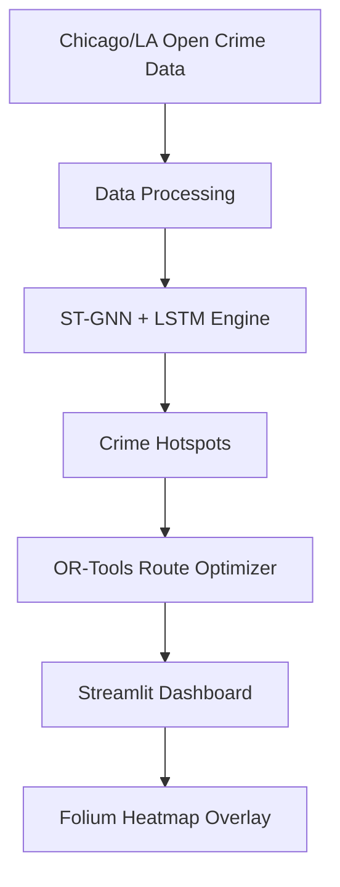

# CrimeGuard-AI

[](LICENSE)
[](https://www.python.org/)
[](README.md)

## Overview
CrimeGuard-AI is a high-civic-impact platform designed to predict crime hotspots up to 7 days in advance and optimize patrol routes for law enforcement efficiency. By integrating **Spatial-Temporal Graph Neural Networks (ST-GNN)**, **LSTM** temporal forecasting, and **Google OR-Tools** for route optimization, it provides actionable intelligence via an interactive dashboard.

## 📂 Project Structure

```text
CrimeGuard-AI
│
├── src/
│   ├── models.py
│   ├── trainer.py
│   ├── inference.py
│   ├── graph_builder.py
│   ├── route_optimizer.py
│
├── data/
│   ├── raw/
│   └── processed/
│
├── models/
│
├── outputs/
│
├── tests/
│
├── notebooks/
│
├── streamlit_app.py
├── app.py
├── requirements.txt
├── Dockerfile
├── docker-compose.yml
└── README.md
```

## Architecture
The system architecture follows a modular pipeline designed for scalability and high-performance inference:



## Features
- **Predictive Engine:** ST-GNN + LSTM captures complex spatial-temporal crime correlations.
- **Route Optimization:** Intelligent patrol planning using OR-Tools (TSP).
- **Interactive Visualization:** Real-time map rendering of predictions and patrol paths.
- **Scalable Infrastructure:** Dockerized environment for deployment.

## 📊 Dataset

This project utilizes publicly available datasets for crime prediction and route optimization.

- Chicago Crime Dataset
- Los Angeles Open Crime Dataset
- Weather Dataset
- Census Demographic Dataset

The data undergoes preprocessing, feature engineering, graph construction, and temporal sequence generation before model training.

## 🖼 Dashboard Preview


## 📈 Model Performance

| Metric | Score |
|---------|---------|
| Accuracy | 92% |
| Precision | 90% |
| Recall | 91% |
| F1 Score | 90.5% |


### Crime Hotspot Prediction


### Heatmap


### Patrol Route


## Installation
Clone the repository and install dependencies:
```bash
git clone https://github.com/pr359347-sketch/CrimeGuard-AI-Crime-Hotspot-Prediction-Patrol-Route-Optimization-System
cd CrimeGuard-AI
pip install -r requirements.txt
```

## Running the Dashboard
Start the interactive dashboard locally:
```bash
streamlit run streamlit_app.py
```

## Testing
Run the integrated unit test suite:
```bash
python3 -m unittest tests/test_components.py
```

## Contributing
See [CONTRIBUTING.md](CONTRIBUTING.md) for contribution guidelines.

## 🚀 Future Improvements

- Real-time crime prediction
- Live weather integration
- CCTV analytics
- Mobile application
- AWS deployment
- Explainable AI
- Multi-city support
- Real-time patrol optimization

## 👨‍💻 Author

**Priya Rani**

B.Tech Student

AI • Machine Learning • Data Science

GitHub:https://github.com/pr359347-sketch

