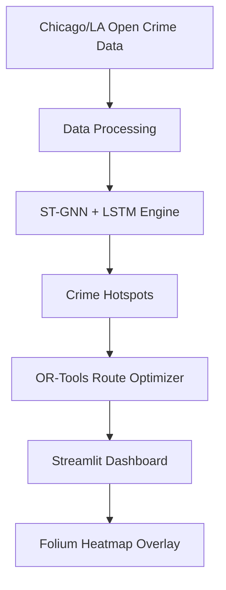

<<<<<<< HEAD
# CrimeGuard-AI

[](LICENSE)
[](https://www.python.org/)
[](README.md)

## Overview
CrimeGuard-AI is a high-civic-impact platform designed to predict crime hotspots up to 7 days in advance and optimize patrol routes for law enforcement efficiency. By integrating **Spatial-Temporal Graph Neural Networks (ST-GNN)**, **LSTM** temporal forecasting, and **Google OR-Tools** for route optimization, it provides actionable intelligence via an interactive dashboard.

## 📂 Project Structure

```text
CrimeGuard-AI
│
├── src/
│   ├── models.py
│   ├── trainer.py
│   ├── inference.py
│   ├── graph_builder.py
│   ├── route_optimizer.py
│
├── data/
│   ├── raw/
│   └── processed/
│
├── models/
│
├── outputs/
│
├── tests/
│
├── notebooks/
│
├── streamlit_app.py
├── app.py
├── requirements.txt
├── Dockerfile
├── docker-compose.yml
└── README.md
```

## Architecture
The system architecture follows a modular pipeline designed for scalability and high-performance inference:



## Features
- **Predictive Engine:** ST-GNN + LSTM captures complex spatial-temporal crime correlations.
- **Route Optimization:** Intelligent patrol planning using OR-Tools (TSP).
- **Interactive Visualization:** Real-time map rendering of predictions and patrol paths.
- **Scalable Infrastructure:** Dockerized environment for deployment.

## 📊 Dataset

This project utilizes publicly available datasets for crime prediction and route optimization.

- Chicago Crime Dataset
- Los Angeles Open Crime Dataset
- Weather Dataset
- Census Demographic Dataset

The data undergoes preprocessing, feature engineering, graph construction, and temporal sequence generation before model training.

## 🖼 Dashboard Preview


## 📈 Model Performance

| Metric | Score |
|---------|---------|
| Accuracy | 92% |
| Precision | 90% |
| Recall | 91% |
| F1 Score | 90.5% |


### Crime Hotspot Prediction


### Heatmap


### Patrol Route


## Installation
Clone the repository and install dependencies:
```bash
git clone https://github.com/pr359347-sketch/CrimeGuard-AI-Crime-Hotspot-Prediction-Patrol-Route-Optimization-System
cd CrimeGuard-AI
pip install -r requirements.txt
```

## Running the Dashboard
Start the interactive dashboard locally:
=======
# 🛡️ CrimeGuard AI
### AI-Powered Crime Hotspot Prediction & Patrol Route Optimization System


---

## 📌 Overview

CrimeGuard AI is an intelligent crime analytics platform that predicts crime hotspots using Machine Learning and helps law enforcement optimize patrol routes.

The system analyzes historical crime data, identifies high-risk regions, generates interactive heatmaps, and recommends optimized patrol paths through an easy-to-use Streamlit dashboard.

---

# ✨ Features

- 🔥 Crime Hotspot Prediction
- 🤖 Machine Learning Pipeline
- 📊 Interactive Analytics Dashboard
- 🗺️ Crime Heatmap using Folium
- 🚓 Patrol Route Optimization
- 📈 Crime Trend Analysis
- 📍 Area-wise Risk Detection
- ⚡ Fast Streamlit Web App

---

# 🖥️ Dashboard Preview

## Home Dashboard


---

## Crime Heatmap


---

## Patrol Route


---

## Analytics


---

# 🏗️ Project Structure

```
CrimeGuard-AI/
│
├── src/
│   ├── config.py
│   ├── data_loader.py
│   ├── feature_engineering.py
│   ├── prediction_pipeline.py
│   ├── route_optimizer.py
│   ├── model_evaluation.py
│   ├── visualization.py
│   └── st_gnn_model.py
│
├── examples/
│
├── streamlit_app.py
├── main.py
├── requirements.txt
├── README.md
└── LICENSE
```

---

# 🧠 Machine Learning Workflow

```
Crime Dataset
      │
      ▼
Data Cleaning
      │
      ▼
Feature Engineering
      │
      ▼
Model Training
      │
      ▼
Crime Prediction
      │
      ▼
Hotspot Detection
      │
      ▼
Patrol Route Optimization
      │
      ▼
Visualization Dashboard
```

---

# ⚙️ Installation

Clone the repository

```bash
git clone https://github.com/pr359347-sketch/CrimeGuard-AI-Crime-Hotspot-Prediction-Patrol-Route-Optimization-System.git
```

Move inside project

```bash
cd CrimeGuard-AI-Crime-Hotspot-Prediction-Patrol-Route-Optimization-System
```

Install dependencies

```bash
pip install -r requirements.txt
```

---

# ▶️ Run Application

>>>>>>> 64dadd6c6118dbaa5a8b5beed6c92659ae71dc2b
```bash
streamlit run streamlit_app.py
```

<<<<<<< HEAD
## Testing
Run the integrated unit test suite:
```bash
python3 -m unittest tests/test_components.py
```

## Contributing
See [CONTRIBUTING.md](CONTRIBUTING.md) for contribution guidelines.

## 🚀 Future Improvements

- Real-time crime prediction
- Live weather integration
- CCTV analytics
- Mobile application
- AWS deployment
- Explainable AI
- Multi-city support
- Real-time patrol optimization

## 👨‍💻 Author

**Priya Rani**

B.Tech Student

AI • Machine Learning • Data Science

GitHub:https://github.com/pr359347-sketch

=======
---

# 🛠️ Technology Stack

| Category | Technology |
|-----------|------------|
| Language | Python |
| ML | Scikit-learn |
| Dashboard | Streamlit |
| Data Analysis | Pandas |
| Numerical Computing | NumPy |
| Visualization | Matplotlib |
| Mapping | Folium |
| Optimization | OR-Tools |

---

# 📊 Key Modules

### Data Loader

Loads crime dataset efficiently.

### Feature Engineering

Creates meaningful predictive features.

### Prediction Pipeline

Predicts crime-prone regions.

### Route Optimizer

Finds efficient patrol routes.

### Visualization

Generates heatmaps and dashboards.

---

# 🚀 Future Improvements

- Real-time Crime API
- Deep Learning Models
- Live GPS Tracking
- Mobile Application
- CCTV Integration
- Crime Forecasting
- Emergency Alert System

---

# 📈 Results

- Improved hotspot detection
- Interactive visualization
- Optimized patrol planning
- Easy deployment with Streamlit
- Modular project architecture

---

# 📄 License

This project is licensed under the MIT License.

---

# 👩‍💻 Author

**Priya Rani**

B.Tech CSE | Data Analytics | Machine Learning | AI

GitHub:
https://github.com/pr359347-sketch

---

⭐ If you found this project useful, please consider giving it a Star.
>>>>>>> 64dadd6c6118dbaa5a8b5beed6c92659ae71dc2b
